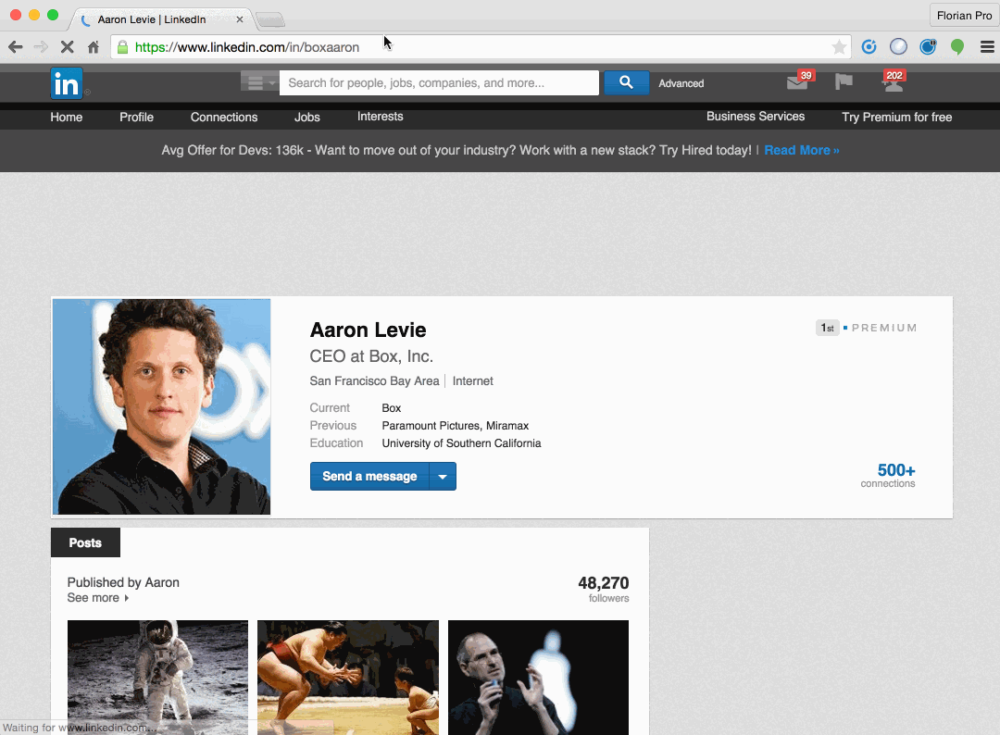

# Airtable LinkedIn Contact Importer

This is a Chrome Extension that runs on the LinkedIn profile pages and allows to import some of the profile data to a given 'Contacts' table on [Airtable](http://www.airtable.com).

I have built this because LinkedIn has closed their API (not cool!) and decided to switch to [Airtable](http://www.airtable.com) to manage my contact list (personal CRM).

This an alpha version and requires a specific field format in the Contacts table. So it's unlikely you can use it just out of the box :)

To load the extension:
* Install the [Chrome Apps & Extensions Developer Tool](https://chrome.google.com/webstore/detail/chrome-apps-extensions-de/ohmmkhmmmpcnpikjeljgnaoabkaalbgc?hl=en)
* git clone this code on your computer
* Click 'Load unpacked...' and pick the cloned directory

Chrome Extension code structure created with [Extensionizr](http://extensionizr.com).
GIF created with [LiceCap](http://www.cockos.com/licecap/).
